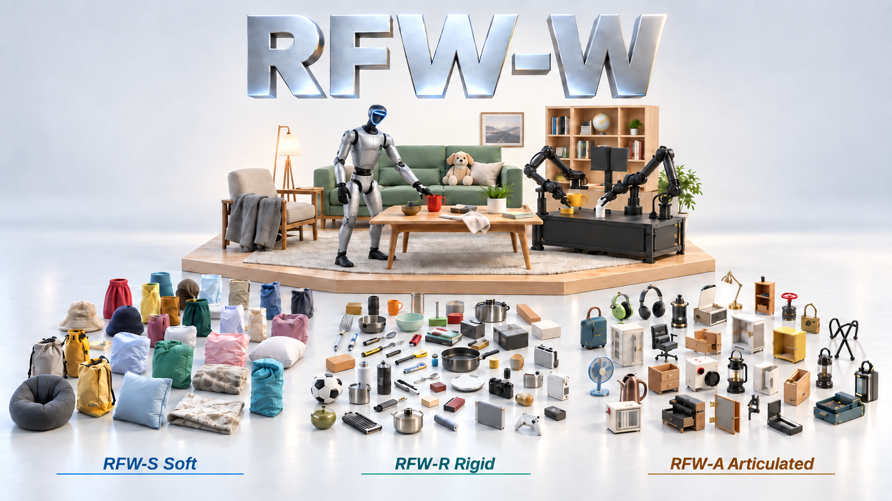

<div align="center">

# RFW-W: Scaling Physical Asset Universes for Generative Embodied Simulation

Anonymous authors

[](#paper)
[](https://github.com/RoboFlywheel-com/RoboFlywheel-World)
[](https://modelscope.cn/datasets/RoboFlywheel/Rigid)

[Overview](#overview) · [Lifecycle](#physical-asset-lifecycle) · [Dataset](#dataset) · [Citation](#citation) · [Release Plan](#release-plan)



<sub>RFW-W turns open-category 3D content into simulation-ready physical assets, and composes them into task-conditioned, physically executable household scenes.</sub>

</div>

---

## Overview

RoboFlywheel-World (RFW-W) is a physical asset universe for generative embodied simulation. It turns open-category 3D content into assets with metric geometry, part-level semantics, collision geometry, physical properties, standardized simulator interfaces, and simulation-verified interaction annotations. A retrieval-grounded agentic system then composes these assets into task-conditioned, physically executable household scenes.

RFW-W unifies three complementary branches through one physical-asset interface:

| Asset | Type | Underlying geometry |
| --- | --- | --- |
| **RFW-R** | Rigid | Static meshes with collision decomposition |
| **RFW-A** | Articulated | Jointed assets with kinematic structure |
| **RFW-S** | Deformable | Soft assets with deformable material models |

**What the release provides**

- **A verifiable physical-asset lifecycle.** Every stage emits typed, independently auditable artifacts, from open-category generation and quality filtering to part decomposition, physical annotation, serialization, and simulation checks.
- **Part-level physical and interaction annotations.** Assets include semantic parts, material and friction fields, mass, center of mass, inertia, graspability, and collision-ready geometry.
- **Executable representations.** Rigid assets are serialized to URDF and MJCF, with OpenUSD used for layered scene composition and simulator execution.
- **Dexterous manipulation readiness.** Simulation-validated grasp annotations support multiple hand morphologies.
- **Task-conditioned world generation.** A retrieval-grounded agent plans scene semantics while deterministic modules own asset binding, placement, physics, and certification.

---

## Physical Asset Lifecycle

RFW-R uses a staged construction pipeline. Each stage produces an artifact that can be inspected and validated on its own.

| Stage | Purpose |
| --- | --- |
| **L0 · Generation** | Taxonomy-conditioned prompts, seed-image synthesis, foreground extraction, and image-to-3D generation |
| **L1 · Rendering** | Physically based multi-view rendering |
| **L2 · Quality control** | Geometric checks, vision-language inspection, category repair, and reclassification salvage |
| **L3 · Structure** | Functional part segmentation and approximate convex collision decomposition |
| **L4 · Physics** | Metric scale, material, friction, mass, center of mass, inertia, and interaction semantics |
| **L5 · Packaging and validation** | URDF/MJCF/USD packaging, cross-simulator inspection, and grasp validation |

Reclassification and same-object repair recover useful geometry that would otherwise be discarded, while preserving visible surfaces, functional openings, and released collision structure.

Each released rigid asset is designed to provide metric-scale visual and collision geometry; simulation-compatible mass, center of mass, inertia, and friction; part-level semantic and interaction annotations; and standardized, executable simulator representations.

---

## From Assets to Embodied Worlds

RFW-W separates semantic reasoning from geometry-dependent execution:

```text
Natural-language task
        ↓
Typed room program → procedural room foundation → support graph
        ↓
Typed object goals → hybrid semantic retrieval → physical filtering
        ↓
Dependency-aware placement → collision and clearance checks
        ↓
Layered OpenUSD composition → physics settlement → visual gates
        ↓
Certified, immutable SceneState
```

The agent specifies room intent, object roles, relations, diversity, and task requirements. It does not emit poses, asset identifiers, mesh paths, or simulator commands. Deterministic modules retrieve assets, solve continuous placement, run physics, and issue typed failures. Failed scenes enter a bounded repair loop and fail closed if certification cannot be completed.

---

## Evaluation

Experiments evaluate the system at the asset, simulation, affordance, policy-transfer, and scene levels.

The experiments show that visual quality alone does not predict physical interaction success. Behavioral validation is therefore treated as first-class dataset content. The evaluation also studies how category breadth affects asset binding, scene fulfillment, dexterous manipulation, policy transfer, and robustness under distribution shift.

---

## Paper

**RFW-W: Scaling Physical Asset Universes for Generative Embodied Simulation**<br>
Anonymous authors

The arXiv preprint and supplementary material are coming soon. See the [release plan](#release-plan) for the planned timeline.

<details>
<summary><b>BibTeX</b></summary>

```bibtex
@article{rfw-w,
  title   = {RFW-W: Scaling Physical Asset Universes for Generative Embodied Simulation},
  author  = {Anonymous},
  journal = {arXiv preprint},
  year    = {2026},
  note    = {To be updated upon release}
}
```

</details>

---

## Data Pipeline

The data pipeline will cover the [physical asset lifecycle](#physical-asset-lifecycle), from asset generation to simulation validation and export. Installation instructions, dependencies, configurations, and runnable examples will be added with the code release in **October 2026**.

**Code repository:** [RoboFlywheel-World on GitHub](https://github.com/RoboFlywheel-com/RoboFlywheel-World)

---

## Dataset

The full dataset is planned for release on **ModelScope** in **November 2026**, covering the RFW-R, RFW-A, and RFW-S branches. The official dataset link, inventory, directory structure, download instructions, and usage examples will be added here when available.

| Asset | Modality | Availability |
| --- | --- | --- |
| **RFW-R** | Rigid | November 2026 |
| **RFW-A** | Articulated | November 2026 |
| **RFW-S** | Deformable | November 2026 |

**ModelScope dataset:** [RoboFlywheel/Rigid](https://modelscope.cn/datasets/RoboFlywheel/Rigid) · **Release:** November 2026

---

## Citation

Citation information will be added with the paper release.

---

## License

License terms will be announced with the corresponding code and data releases.

---

## Release Plan

- [ ] Asset pipeline and code — October 2026
- [ ] Full dataset on ModelScope — November 2026
- [ ] Paper on arXiv — TBD
